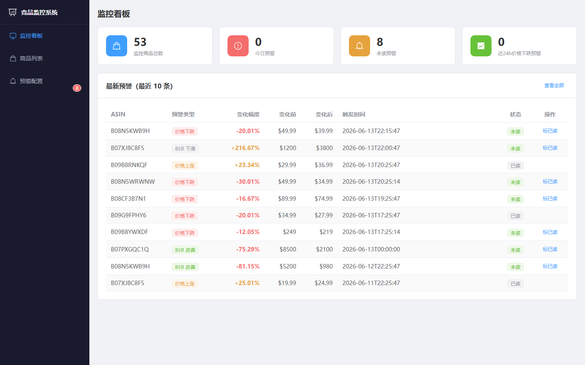
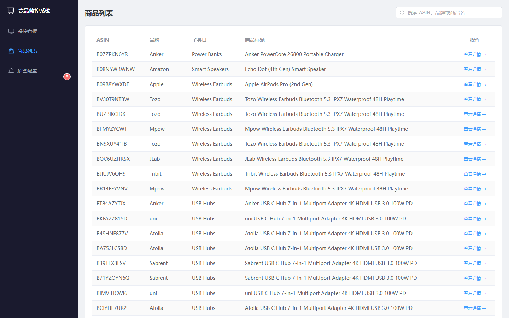
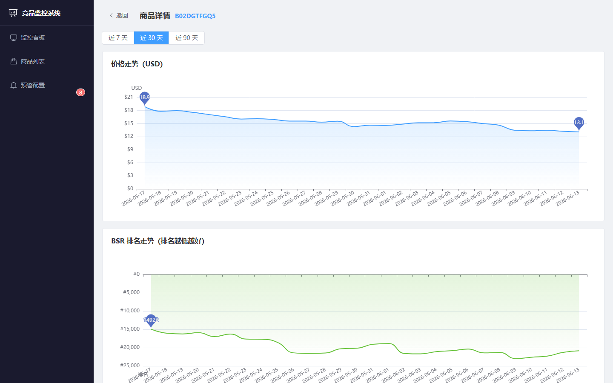
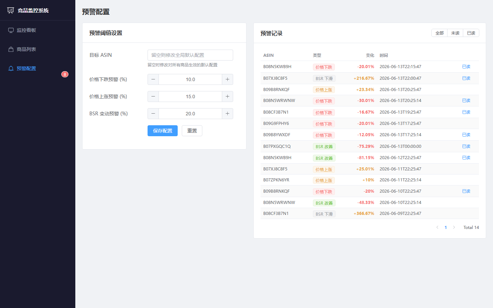
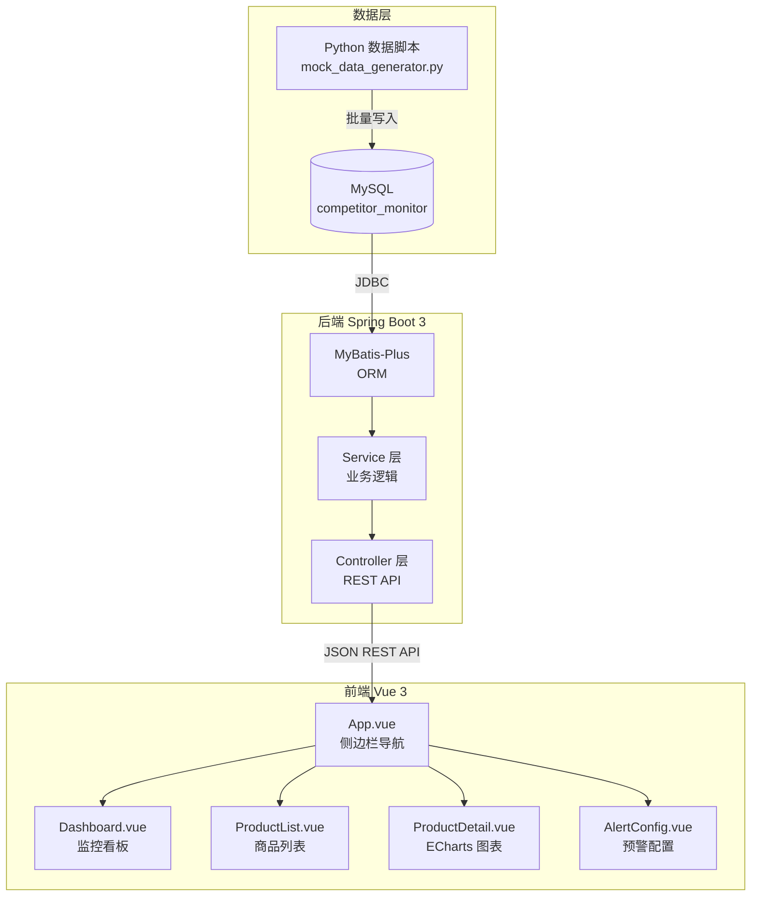

# 跨境电商竞品监控系统

> 模拟真实 Amazon 卖家日常监控竞品的工作场景，实现价格追踪、BSR 排名变化与智能预警，将每日巡检时间从 2 小时压缩到 15 分钟。



---

## 核心功能

| 功能模块 | 说明 |
|----------|------|
| 📊 监控看板 | 4 个核心指标卡（监控商品数/今日预警/未读预警/近 24h 价格下跌）+ 最新预警表格，一屏掌握所有异动 |
| 📦 商品列表 | 分页展示 50+ 监控 ASIN，支持品牌 / 标题 / ASIN 实时搜索（300ms 防抖） |
| 📈 商品详情 | 价格走势 + BSR 排名走势双折线图，支持 7 / 30 / 90 天时间维度切换 |
| 🔔 预警配置 | 全局阈值 + ASIN 级独立配置（ASIN 级优先），支持价格下跌 / 上涨 / BSR 变动三类预警 |
| 📋 预警记录 | 按全部 / 未读 / 已读三挡筛选，一键标记已读，侧边栏未读角标实时更新 |

---

## 界面预览

| 商品列表 | 价格 & BSR 走势图 |
|---------|------------------|
|  |  |

**预警配置页**（左：阈值表单，右：预警记录）：



---

## 技术架构



**技术栈**

| 层级 | 技术 |
|------|------|
| 后端 | Spring Boot 3.2 · Java 17 · MyBatis-Plus 3.5 · MySQL 8.0 · Lombok |
| 前端 | Vue 3.4 · Vue Router 4 · Element Plus 2.6 · ECharts 5.5 · Vite 5 |
| 数据脚本 | Python · pymysql · numpy · Faker |

---

## 目录结构

```
competitor-monitor/
├── sql/
│   └── init.sql               # 建表 SQL（6 张表）
├── data-scripts/
│   ├── requirements.txt
│   └── mock_data_generator.py # 生成 50 商品 × 90 天模拟数据
├── backend/
│   └── src/main/java/com/ecom/monitor/
│       ├── controller/        # ProductController / DashboardController / AlertController
│       ├── service/impl/      # 业务逻辑实现
│       ├── entity/            # Product / PriceHistory / BsrHistory / Alert / AlertConfig
│       ├── mapper/            # MyBatis-Plus BaseMapper
│       ├── dto/               # 请求 / 响应 DTO
│       └── common/Result.java # 统一响应格式
└── frontend/src/
    ├── api/index.js           # Axios 请求封装
    ├── router/index.js        # 前端路由
    ├── App.vue                # 侧边栏布局（含未读角标）
    └── views/                 # Dashboard / ProductList / ProductDetail / AlertConfig
```

---

## 本地运行

### 前置条件

- JDK 17+ · Maven 3.8+ · MySQL 8.0+ · Python 3.9+ · Node.js 18+

### 第一步：初始化数据库

```bash
mysql -u root -p < sql/init.sql
```

### 第二步：生成模拟数据

```bash
cd data-scripts
pip install -r requirements.txt
python mock_data_generator.py
# 生成 50 商品 × 90 天 ≈ 13,500 条时序数据 + ~135 条预警记录
```

### 第三步：启动后端

```bash
cd backend
# application.yml 中数据库密码默认读取环境变量 DB_PASSWORD
DB_PASSWORD=your_password mvn spring-boot:run
# 后端运行在 http://localhost:8080
```

### 第四步：启动前端

```bash
cd frontend
npm install
npm run dev
# 前端运行在 http://localhost:5173
```

---

## API 接口

| 方法 | 路径 | 说明 |
|------|------|------|
| GET | `/api/products/list` | 商品列表（分页，支持 keyword 搜索） |
| GET | `/api/products/{asin}/price-history` | 价格历史（`?days=30`） |
| GET | `/api/products/{asin}/bsr-history` | BSR 排名历史（`?days=30`） |
| GET | `/api/dashboard/overview` | 看板概览（4 个指标卡数据） |
| GET | `/api/alerts/list` | 预警列表（分页，可按 `isRead` 筛选） |
| GET | `/api/alerts/config` | 获取预警配置（ASIN 级 → 全局回退） |
| POST | `/api/alerts/config` | 保存预警配置 |
| PUT | `/api/alerts/{id}/read` | 标记预警已读 |
| GET | `/api/alerts/unread-count` | 未读预警数量 |

---

## 核心业务逻辑

**预警类型（4 种）**

| 类型 | 枚举值 | 触发条件（默认阈值） |
|------|--------|---------------------|
| 价格下跌 | `PRICE_DROP` | 相邻两日价格下跌 ≥ 10% |
| 价格上涨 | `PRICE_RISE` | 相邻两日价格上涨 ≥ 15% |
| BSR 改善 | `BSR_IMPROVE` | BSR 排名变动 ≥ -20%（排名数字减小） |
| BSR 下滑 | `BSR_DROP` | BSR 排名变动 ≥ +20%（排名数字增大） |

**预警配置两级回退**：`AlertServiceImpl.getConfig()` 先查指定 ASIN 的独立配置，不存在则返回 ASIN 为空的全局默认配置。

**数据规模**：50 个 ASIN × 90 天 × 价格 / BSR / 评论三类时序 ≈ 13,500 条记录，预警记录约 135 条。

---

## 数据库设计

| 表名 | 说明 |
|------|------|
| `products` | ASIN 基础信息（50 条） |
| `price_history` | 每日价格记录（90 天） |
| `bsr_history` | 每日 BSR 排名记录 |
| `review_stats` | 评论数历史 |
| `alerts` | 预警事件记录 |
| `alert_config` | 预警阈值配置（支持全局 + ASIN 级） |

---

## 🗺 后续规划

- [ ] 后端每 N 分钟定时扫描价格变化、自动生成预警（当前预警由 Python 脚本离线生成）
- [ ] 集成 Caffeine 本地缓存，降低热点接口数据库查询压力
- [ ] 邮件 / 微信通知：预警触发时推送到运营人员
- [ ] 商品历史数据 CSV / Excel 一键导出

---

## 简历描述

```
跨境电商竞品监控系统 | Spring Boot 3 + Vue 3 + MySQL | 个人项目

• 设计全栈竞品监控系统，覆盖 50 个 Amazon ASIN 的价格与 BSR 排名自动追踪
• Python 脚本模拟 90 天历史数据（正态分布波动），生成 13,500+ 条时序记录
• 实现两级预警配置（ASIN 级 > 全局回退），支持价格下跌/上涨/BSR 双向 4 类预警
• 前端 Vue 3 + ECharts 绘制价格与 BSR 走势折线图，支持 7/30/90 天时间维度切换
• 基于 MyBatis-Plus 实现分页查询与时序范围查询，接口响应时间 < 100ms
```
