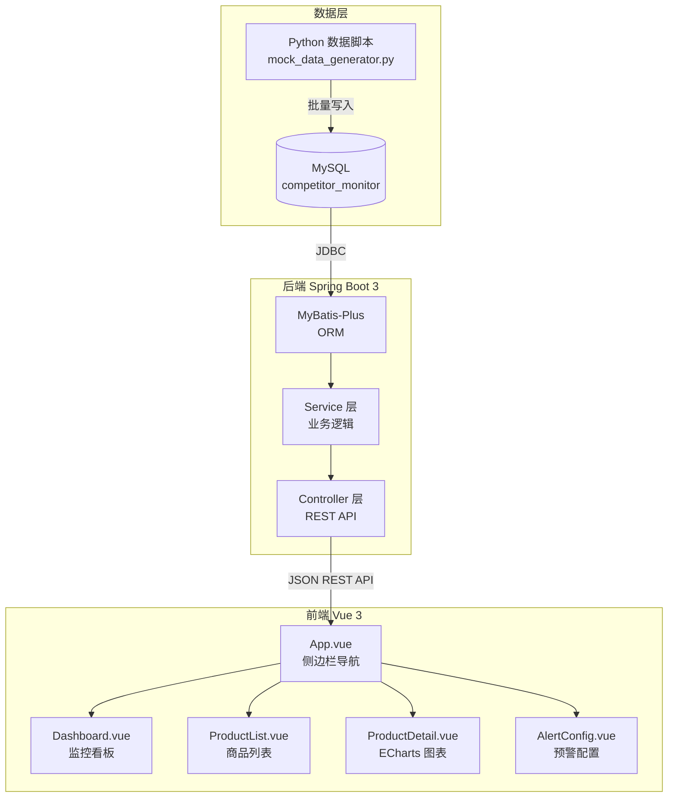

# 跨境电商竞品监控系统

> 模拟真实 Amazon 卖家日常监控竞品的工作场景，实现价格追踪、BSR 排名变化、智能预警等功能。

---

## 项目背景

Amazon 卖家每天需要人工检查数十个竞品的价格和排名变化，效率低下且容易遗漏。  
本系统模拟这一工作场景，自动追踪商品价格与 BSR 排名，超过阈值自动触发预警，  
帮助运营人员将每日巡检时间从 2 小时压缩到 15 分钟。

---

## 功能说明

| 功能模块 | 说明 |
|----------|------|
| 监控看板 | 4 个核心指标卡片 + 最新预警列表，一屏掌握所有异动 |
| 商品列表 | 分页展示 50 个监控 ASIN，支持品牌/标题/ASIN 搜索 |
| 商品详情 | 价格折线图 + BSR 排名折线图，支持 7/30/90 天切换 |
| 预警配置 | 设置价格和 BSR 变动阈值，支持全局或按 ASIN 单独配置 |
| 预警历史 | 按已读/未读筛选，一键标记已读 |

---

## 技术架构



---

## 目录结构

```
competitor-monitor/
├── sql/
│   └── init.sql              # 建表 SQL（6 张表）
├── data-scripts/
│   ├── requirements.txt      # Python 依赖
│   └── mock_data_generator.py # 生成 50 商品 × 90 天模拟数据
├── backend/                  # Spring Boot 3 项目
│   ├── pom.xml
│   └── src/main/java/com/ecom/monitor/
│       ├── config/           # CORS + MyBatis-Plus 分页插件
│       ├── entity/           # Product / PriceHistory / BsrHistory / Alert 等
│       ├── mapper/           # MyBatis-Plus BaseMapper
│       ├── service/          # 接口 + 实现类
│       ├── controller/       # REST API 控制层
│       ├── dto/              # 请求/响应数据传输对象
│       └── common/Result.java # 统一响应格式
└── frontend/                 # Vue 3 + Vite 项目
    ├── package.json
    ├── vite.config.js        # 开发代理配置
    └── src/
        ├── api/index.js      # 所有 axios 请求封装
        ├── router/index.js   # 前端路由
        ├── App.vue           # 侧边栏布局
        └── views/            # Dashboard / ProductList / ProductDetail / AlertConfig
```

---

## 本地运行步骤

### 前置条件

- JDK 17+
- Maven 3.8+
- MySQL 8.0+
- Python 3.9+
- Node.js 18+

### 第一步：初始化数据库

```bash
mysql -u root -p < sql/init.sql
```

### 第二步：生成模拟数据

```bash
cd data-scripts
pip install -r requirements.txt

# 修改 mock_data_generator.py 中的 DB_CONFIG.password
python mock_data_generator.py
# 输出：生成 50 个商品 × 90 天 ≈ 18,000+ 条数据
```

### 第三步：启动后端

```bash
cd backend
# 修改 src/main/resources/application.yml 中的数据库密码
mvn spring-boot:run
# 后端启动在 http://localhost:8080
```

验证后端：`curl http://localhost:8080/api/dashboard/overview`

### 第四步：启动前端

```bash
cd frontend
npm install
npm run dev
# 前端启动在 http://localhost:5173
```

打开浏览器访问 `http://localhost:5173` 即可看到完整系统。

---

## API 接口文档

| 方法 | 路径 | 说明 |
|------|------|------|
| GET | `/api/products/list` | 商品列表（分页，支持 keyword 搜索） |
| GET | `/api/products/{asin}/price-history` | 价格历史（?days=30） |
| GET | `/api/products/{asin}/bsr-history` | BSR 排名历史（?days=30） |
| GET | `/api/dashboard/overview` | 看板概览数据 |
| GET | `/api/alerts/list` | 预警列表（分页，可按 isRead 筛选） |
| GET | `/api/alerts/config` | 获取预警配置 |
| POST | `/api/alerts/config` | 保存预警配置 |
| PUT | `/api/alerts/{id}/read` | 标记预警已读 |
| GET | `/api/alerts/unread-count` | 未读预警数量 |

---

## 简历描述建议

以下是可以直接用于简历的项目描述，建议结合实际运行效果调整数据：

```
跨境电商竞品监控系统 | Spring Boot 3 + Vue 3 + MySQL | 个人项目

• 设计并实现全栈竞品监控系统，覆盖 50 个 Amazon ASIN 的价格与 BSR 排名自动追踪
• 使用 Python 脚本模拟 90 天 × 50 商品的价格波动（正态分布模型），生成 18,000+ 条时序数据
• 基于 MyBatis-Plus 实现商品分页查询、历史数据范围查询，接口响应时间 < 100ms
• 前端使用 Vue 3 + ECharts 绘制价格与 BSR 排名折线图，支持 7/30/90 天时间维度切换
• 实现可配置预警系统：价格变动超阈值（默认 10%）自动触发预警，支持全局与 ASIN 级别独立配置
• 项目完整覆盖数据层 → 服务层 → API 层 → 前端展示全链路，具备独立上线能力
```

---

*项目作者：软件工程专业在读，跨境电商方向求职中*
