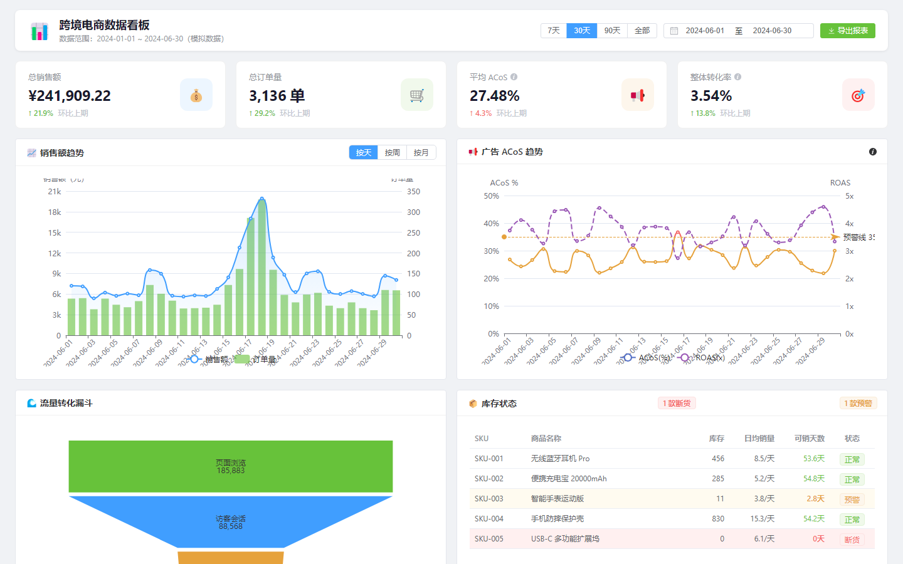
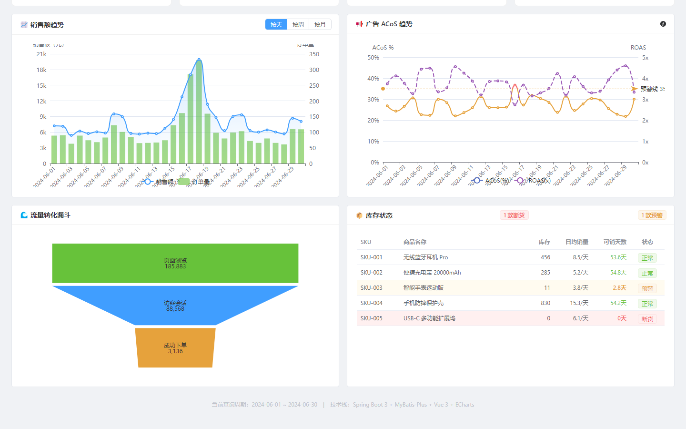
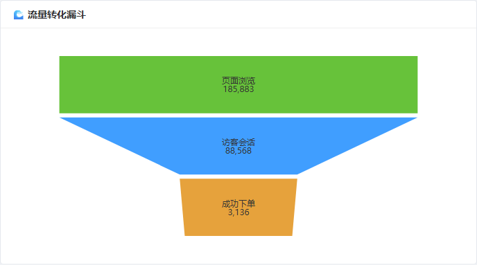
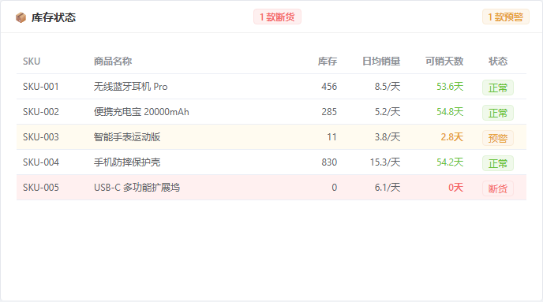
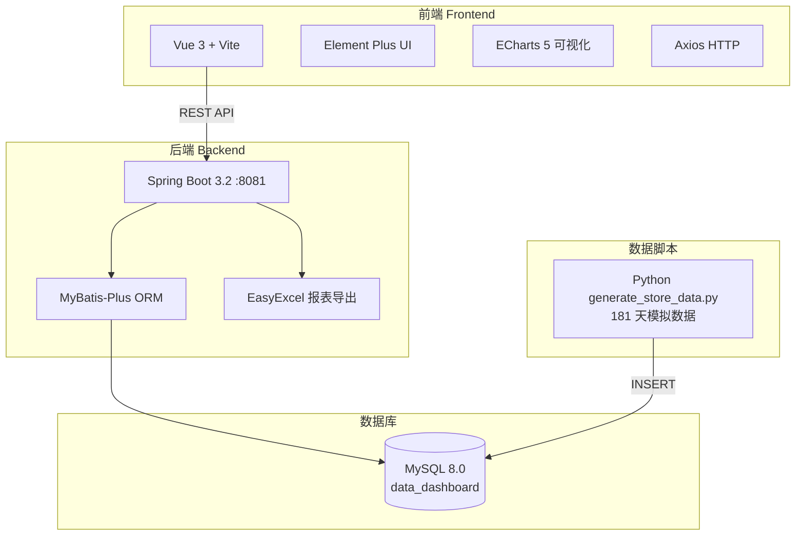

# 跨境电商店铺经营数据看板

> 整合销售、广告、流量、库存四大核心模块，将分散在各平台的 12 项运营指标统一汇总到一个实时看板，并支持按时间区间筛选与一键 Excel 导出。



---

## 核心功能

| 功能 | 说明 |
|------|------|
| 📊 KPI 卡片 | 总销售额 / 订单量 / 平均 ACoS / 转化率，含环比变化箭头（↑↓） |
| 📈 销售趋势 | 折线 + 柱状混合图，支持日 / 周 / 月粒度切换 |
| 📉 广告表现 | ACoS 趋势图，含 35% 预警参考线与 visualMap 颜色分段（绿 / 橙 / 红） |
| 🔽 流量漏斗 | 页面浏览 → 访客会话 → 成功下单三层漏斗，直观展示流量损耗 |
| 📦 库存状态 | SKU 库存表格，含「断货」红色行 + 「预警」橙色行高亮 |
| 📥 Excel 导出 | EasyExcel 双 Sheet（销售数据 + 广告数据）一键下载 |
| 🗓 时间区间 | 快捷按钮（近 7 天 / 30 天 / 90 天 / 全部）+ 日期选择器自定义 |

---

## 界面预览

| 广告 ACoS 趋势图 | 流量转化漏斗 |
|----------------|-------------|
|  |  |

**库存状态表格**（断货红色 / 预警橙色 / 正常绿色）：



---

## 技术架构



**技术栈**

| 层级 | 技术 |
|------|------|
| 后端 | Spring Boot 3.2 · Java 17 · MyBatis-Plus · EasyExcel · Lombok |
| 前端 | Vue 3 · Element Plus · ECharts 5 · Axios · Vite |
| 数据脚本 | Python · mysql-connector-python |

---

## API 接口

| 方法 | 路径 | Controller | 说明 |
|------|------|-----------|------|
| GET | `/api/dashboard/summary` | DashboardController | 时间段核心指标汇总（含环比） |
| GET | `/api/sales/trend` | SalesController | 销售趋势（`?period=day\|week\|month`） |
| GET | `/api/ads/performance` | AdsController | 广告表现（ACoS / ROAS / CTR 时序） |
| GET | `/api/traffic/funnel` | TrafficController | 流量漏斗（三层：浏览→会话→成单） |
| GET | `/api/inventory/status` | InventoryController | 库存状态（含断货 / 预警分级） |
| GET | `/api/report/export` | ReportController | 导出 Excel（双 Sheet，直写 HttpServletResponse） |

---

## 核心业务逻辑

**环比计算**：`DashboardServiceImpl` 将请求时间段等长前推，分别查询本期与上期汇总，计算 `(本期 - 上期) / 上期 × 100%`，返回差值与箭头方向。

**ACoS 预警分色**：ECharts `visualMap` 组件按阈值段自动着色——ACoS < 20% 绿色（良好）、20%–35% 橙色（合理）、> 35% 红色（过高）；`markLine` 标注 35% 警戒线。

**库存预警分级**：`InventoryController` 返回 `statusLabel`（正常 / 预警 / 断货），前端 `el-table` 通过 `row-class-name` 绑定对应 CSS 类实现行高亮。

**EasyExcel 双 Sheet 导出**：`ReportServiceImpl` 使用 `ExcelWriter` 在同一个 Workbook 写入 Sheet1（销售数据）和 Sheet2（广告数据），通过 `response.setContentType` 触发浏览器下载。

**指标公式**

| 指标 | 公式 |
|------|------|
| ACoS | 广告花费 / 广告销售额 × 100% |
| ROAS | 广告销售额 / 广告花费 |
| CTR | 点击量 / 曝光量 × 100% |
| 转化率 | 成单数 / 会话数 × 100% |
| 环比变化 | (本期 - 上期) / 上期 × 100% |
| 可销天数 | 库存数量 / 日均销量 |

---

## 数据模型

| 表名 | 字段说明 |
|------|---------|
| `daily_sales` | date / revenue / orders / avg_order_value / refund_count |
| `ad_performance` | date / ad_spend / impressions / clicks / ad_revenue |
| `traffic_stats` | date / sessions / page_views / conversions |
| `inventory` | sku / product_name / stock_qty / daily_sales_avg / alert_threshold |

**模拟数据特征**：
- 时间范围：2024-01-01 ~ 2024-06-30（181 天）
- 销售趋势：整体增长 ~30%，促销节点（情人节 ×2.2 / 618 ×3.0）自动叠加峰值
- 广告 ACoS：在 20%~35% 行业区间内随机波动
- 库存：5 个 SKU，含 1 个断货（SKU-005）、1 个预警（SKU-003）

---

## 本地运行

### 前置条件

- JDK 17+ · Maven 3.8+ · MySQL 8.0+ · Python 3.10+ · Node.js 18+

### 1. 初始化数据库

```bash
mysql -u root -p < sql/init.sql
```

### 2. 生成模拟数据

```bash
cd data-scripts
pip install mysql-connector-python
# 修改 generate_store_data.py 中的 DB_CONFIG（password）
python generate_store_data.py
# 生成 181 天 × 4 张表的完整数据
```

### 3. 启动后端

```bash
cd backend
# 修改 src/main/resources/application.yml 中的数据库密码
# 或设置环境变量 DB_PASSWORD
mvn spring-boot:run
# 后端运行在 http://localhost:8081
```

### 4. 启动前端

```bash
cd frontend
npm install
npm run dev
# 前端运行在 http://localhost:5173
```

### 5. 访问看板

打开浏览器访问 `http://localhost:5173`

---

## 项目结构

```
data-dashboard/
├── backend/src/main/java/com/dashboard/
│   ├── controller/   DashboardController / SalesController / AdsController
│   │                 TrafficController / InventoryController / ReportController
│   ├── service/      6 个 Service 接口 + impl
│   ├── mapper/       4 个 MyBatis-Plus Mapper
│   ├── entity/       DailySales / AdPerformance / TrafficStats / Inventory
│   ├── vo/           6 个 API 响应 VO
│   └── config/       CORS 跨域配置
├── frontend/src/
│   ├── views/Dashboard.vue   主看板（~660 行，单页应用）
│   ├── components/MetricCard.vue
│   ├── api/          Axios 封装
│   └── utils/        数字格式化
├── data-scripts/generate_store_data.py
└── sql/init.sql
```

---

## 简历描述

```
跨境电商数据看板 | Spring Boot 3 + Vue 3 + ECharts | 个人项目

• 独立开发跨境电商数据看板，整合销售、广告、流量、库存 4 大模块共 12 项核心运营指标
• 后端构建 6 个 REST API，实现环比自动计算、库存断货分级预警
• ECharts 折线 + 柱状混合图支持日/周/月粒度切换；ACoS 趋势图含 visualMap 颜色分段
• EasyExcel 实现双 Sheet Excel 报表导出，替代人工制表节省每日 1-2 小时
• 覆盖 2024 上半年 181 天历史数据，含情人节 / 618 促销峰值模拟
```
