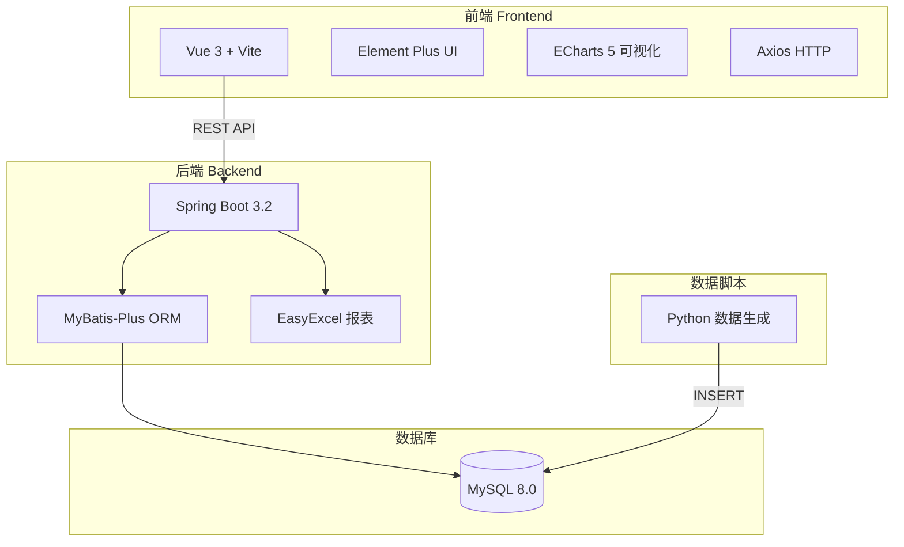

# 跨境电商店铺经营数据看板

> 面向跨境电商运营团队的数据可视化工具，整合销售、广告、流量、库存四大核心模块，
> 解决运营人员每天手动制作报表、数据分散难以汇总的问题。

---

## 项目背景

跨境电商日常运营中，数据来自多个平台（Seller Central、AMS、Shopify 等），
运营人员需要手动整合 Excel，耗时且容易出错。本项目将核心运营指标统一汇总到一个
实时看板，支持按时间区间筛选、趋势图对比分析、一键导出 Excel 报表。

---

## 技术架构



---

## 核心指标与计算公式

| 指标 | 公式 | 说明 |
|------|------|------|
| **ACoS** | `广告花费 / 广告销售额 × 100%` | 越低越好，行业合理区间 20%~35% |
| **ROAS** | `广告销售额 / 广告花费` | 每1元广告带来的销售额，越高越好 |
| **CTR** | `点击量 / 曝光量 × 100%` | 广告点击率 |
| **转化率** | `成单数 / 会话数 × 100%` | 访客购买转化率，行业均值约 2%~5% |
| **客单价** | `销售额 / 订单量` | 每单平均消费金额 |
| **退款率** | `退款数 / 订单量 × 100%` | 低于 5% 为健康水平 |
| **可销天数** | `库存数量 / 日均销量` | 低于预警阈值触发断货预警 |
| **环比变化** | `(本期 - 上期) / 上期 × 100%` | 与上一个相同时长周期对比 |

---

## API 接口列表

| 方法 | 路径 | 说明 |
|------|------|------|
| GET | `/api/dashboard/summary` | 时间段核心指标汇总（含环比） |
| GET | `/api/sales/trend` | 销售趋势（day/week/month） |
| GET | `/api/ads/performance` | 广告表现（ACoS/ROAS/CTR） |
| GET | `/api/traffic/funnel` | 流量漏斗（会话→浏览→成单） |
| GET | `/api/inventory/status` | 库存状态（含断货预警） |
| GET | `/api/report/export` | 导出 Excel 报表（双 Sheet） |

---

## 本地运行步骤

### 环境要求

- JDK 17+
- Maven 3.8+
- Node.js 18+
- MySQL 8.0+
- Python 3.10+（仅数据脚本）

### 1. 初始化数据库

```bash
mysql -u root -p < sql/init.sql
```

### 2. 生成模拟数据

```bash
cd data-scripts
pip install mysql-connector-python
# 修改 generate_store_data.py 中的 DB_CONFIG（用户名/密码）
python generate_store_data.py
```

### 3. 启动后端

```bash
cd backend
# 修改 src/main/resources/application.yml 中的数据库密码
mvn spring-boot:run
# 后端启动在 http://localhost:8080
```

### 4. 启动前端

```bash
cd frontend
npm install
npm run dev
# 前端启动在 http://localhost:5173
```

### 5. 访问看板

打开浏览器访问 `http://localhost:5173`

---

## 数据模型

```
daily_sales     每日销售：date / revenue / orders / avg_order_value / refund_count
ad_performance  广告表现：date / ad_spend / impressions / clicks / ad_revenue
traffic_stats   流量统计：date / sessions / page_views / conversions
inventory       库存数据：sku / product_name / stock_qty / daily_sales_avg / alert_threshold
```

---

## 模拟数据特征

- 时间范围：2024-01-01 ~ 2024-06-30（181 天）
- 销售趋势：整体增长约 30%，叠加促销峰值
- 促销节点：情人节（×2.2）、女神节（×2.0）、618（×3.0）
- 广告 ACoS：在 20%~35% 行业合理区间内波动
- 库存：5 个 SKU，含 1 个断货（SKU-005）+ 1 个预警（SKU-003）

---

## 简历量化描述建议

> 以下文字可直接用于简历项目描述：

**中文版：**
> 独立开发跨境电商数据看板，整合销售、广告、流量、库存 4 大模块共 12 项核心运营指标，
> 覆盖 6 个月 / 180+ 天历史数据；后端基于 Spring Boot 3 + MyBatis-Plus 构建 6 个 REST API，
> 前端使用 Vue 3 + ECharts 实现折线图、漏斗图等多种可视化，支持日/周/月粒度趋势分析、
> 环比变化自动计算及 Excel 一键导出；解决运营团队每日手动制表耗时问题，提升数据决策效率。

**English Version (for international resume):**
> Built a full-stack e-commerce analytics dashboard integrating 12 KPIs across sales,
> advertising, traffic, and inventory modules, covering 6 months of historical data.
> Developed 6 REST APIs with Spring Boot 3 + MyBatis-Plus; built interactive charts
> (line, funnel) with Vue 3 + ECharts featuring time-granularity switching (day/week/month),
> period-over-period comparison, and one-click Excel export via EasyExcel.

---

## 项目结构

```
data-dashboard/
├── backend/                    Spring Boot 后端
│   ├── pom.xml
│   └── src/main/java/com/dashboard/
│       ├── controller/         6 个 REST Controller
│       ├── service/            6 个 Service 接口 + impl
│       ├── mapper/             4 个 MyBatis-Plus Mapper
│       ├── entity/             4 个数据库实体
│       ├── vo/                 6 个 API 响应 VO
│       └── config/             CORS 跨域配置
├── frontend/                   Vue 3 前端
│   ├── src/views/Dashboard.vue 主看板页面（ECharts 图表）
│   ├── src/components/         MetricCard 指标卡片组件
│   ├── src/api/                Axios API 封装
│   └── src/utils/              数字格式化工具
├── data-scripts/
│   └── generate_store_data.py  Python 模拟数据生成脚本
├── sql/
│   └── init.sql                数据库建表语句
└── README.md
```
