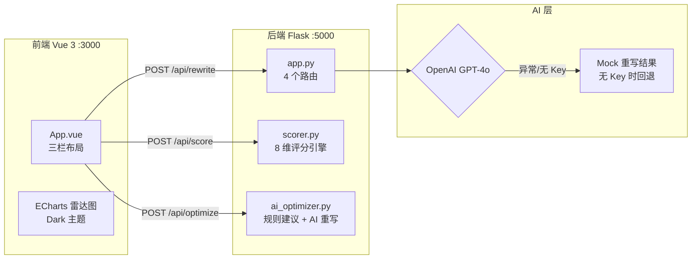

# Amazon Listing 质量评分与优化引擎

> 基于 Amazon A9 算法的 8 维量化评分模型，提供中文优化建议与 AI 驱动的英文 Listing 重写，将 Listing 人工审查时间从 30 分钟压缩到 3 分钟。


---

## 核心功能

- **8 维量化评分**：标题长度 / 关键词密度 / Bullet 数量 / Bullet 长度 / 描述长度 / 图片数量 / 价格竞争力 / 评论数量，加权算出 0–100 分与 A/B/C/D 等级
- **ECharts 雷达图**：Dark 主题 8 轴雷达图，直观呈现各维度得分分布
- **三级优化建议**：规则引擎按得分自动分类为⚠紧急修复 / ↑重点提升 / ✓速效优化
- **AI 重写 Listing**：调用 OpenAI GPT-4o 重写标题 / Bullet / 描述，无 API Key 时自动切换 Mock 模式完整演示
- **演示数据一键加载**：点击「加载演示数据」按钮自动填充低分水杯 Listing，可立即演示完整评分流程

---

## 界面预览

| 中文优化建议（三级分类） | AI 重写对比 |
|------------------------|------------|
|  |  |

---

## 技术架构



**技术栈**

| 层级 | 技术 |
|------|------|
| 后端 | Python 3.11 · Flask 3.0 · flask-cors · openai · python-dotenv |
| 前端 | Vue 3.4 · ECharts 5.5（雷达图 dark 主题）· GSAP 3.15（ScrollTrigger / Flip）· Axios · Vite 5 |
| AI | OpenAI GPT-4o API（无 Key 自动 Mock，演示效果一致） |
| 主题 | Night Freight 暗色设计系统（深炭灰 #0E0F12 · 货柜橙 #FF7A1A · JetBrains Mono 数字字体） |

---

## 评分模型

### 8 维评分维度

| # | 维度 | 权重 | 最优区间 | 核心原理 |
|---|------|------|----------|---------|
| 1 | 标题长度 | ×2 | 80–200 字符 | A9 权重最高字段；过短则关键词不足，过长移动端被截断 |
| 2 | 关键词密度 | ×2 | 主词出现 1–2 次 | 自然融入 SEO 基础；重复 ≥ 3 次触发 Amazon 惩罚 |
| 3 | Bullet Points 数量 | ×2 | 5 条（满配） | 买家决策必读；少于 3 条严重影响转化 |
| 4 | Bullet 平均长度 | ×2 | 150–250 字符/条 | 黄金区间：功能 + 收益 + 数据均可表达 |
| 5 | 描述文字长度 | ×1 | > 1000 字符 | Amazon 索引的重要 SEO 字段 |
| 6 | 图片数量 | ×1 | 7 张（满配） | 转化第一要素；7 张覆盖白底 / 场景 / 细节 / 尺寸 / 信息图 |
| 7 | 价格竞争力 | ×1 | 类目均价 ±15% | A9 Buy Box 核心因素，直接影响点击率 |
| 8 | 评论数量 | ×1 | > 50 条 | 最强信任信号；50 条是大多数类目最低竞争门槛 |

### 评论数分段函数

评论数维度不是线性评分，而是分段处理：

```
< 50 条     线性增长（0→10 分）
50–500 条   最佳区间，满分 10 分
500–2000 条 缓慢衰减（竞争门槛已很高）
> 2000 条   趋稳在 7 分（头部品牌竞争激烈）
```

### 加权计算公式

```
总分 = Σ(各维度得分 × 权重) / Σ权重 × 10
等级：A (≥85) · B (70–84) · C (55–69) · D (<55)
```

---

## 优化建议分级规则

`ai_optimizer.py` 中的规则引擎按维度得分自动分类：

| 分级 | 得分区间 | 含义 |
|------|---------|------|
| ⚠ 紧急修复 (priority_actions) | < 5 | 严重影响排名与转化，优先解决 |
| ↑ 重点提升 (improvements) | 5 – 7.5 | 仍有明显提升空间 |
| ✓ 速效优化 (quick_wins) | 7.5 – 9 | 得分已好，小改动可进一步提升 |

---

## API 接口

| 方法 | 路径 | 说明 |
|------|------|------|
| POST | `/api/score` | 8 维评分，返回各维度得分 + 总分 + 等级 + summary |
| POST | `/api/optimize` | 规则引擎优化建议（三级分类） |
| POST | `/api/rewrite` | AI 重写（GPT-4o 或 Mock） |
| GET | `/api/health` | 健康检查，返回 `{status, ai_mode: real\|mock}` |

**请求示例（`POST /api/score`）：**

```json
{
  "title": "Water Bottle Stainless Steel 32oz Vacuum Insulated",
  "bullets": ["Keeps drinks cold", "BPA Free", "Leak Proof"],
  "description": "This water bottle is made of stainless steel.",
  "image_count": 4,
  "price": 34.99,
  "avg_category_price": 25.00,
  "review_count": 12
}
```

---

## 本地运行

### 1. 启动后端

```bash
cd backend
pip install -r requirements.txt
python app.py
# 后端运行在 http://localhost:5000
```

### 2. 配置 OpenAI API Key（可选）

```bash
# Windows PowerShell
$env:OPENAI_API_KEY="sk-...your-key..."
# Linux / macOS
export OPENAI_API_KEY=sk-...your-key...
```

> **不配置也可完整演示**：系统自动进入 Mock 模式，返回专业示例重写结果，面试演示效果与真实 API 一致。

### 3. 启动前端

```bash
cd frontend
npm install
npm run dev
# 前端运行在 http://localhost:3000
```

### 4. 演示流程

1. 打开 `http://localhost:3000`
2. 点击「📋 加载演示数据」——自动填充一个低分水杯 Listing（C 级，61.5 分）
3. 点击「🔍 开始评分」——查看雷达图与 8 维评分卡
4. 点击「💡 获取优化建议」——查看三级优化建议
5. 点击「✨ AI 重写 Listing」——查看 AI 重写对比

---

## 🗺 后续规划

- [ ] 支持批量评分（CSV 上传，批量分析多个 Listing）
- [ ] 历史评分记录对比（追踪 Listing 优化效果随时间的变化）
- [ ] 类目基准线：根据不同类目动态调整各维度阈值

---

## 简历描述

```
Amazon Listing 质量评分与优化引擎 | Python Flask + Vue 3 + OpenAI | 个人项目

• 研究 Amazon A9 算法，提炼 8 个核心评分维度（含权重 / 最优区间 / 分段函数），量化 Listing 质量
• 实现规则引擎将优化建议自动分为三级优先级，为运营提供可执行的改进路径
• 集成 OpenAI GPT-4o 进行英文 Listing 重写，设计 Mock 回退机制保证无 Key 时完整演示
• 前端三栏布局（输入 / 评分雷达图 / 建议），ECharts Dark 主题 8 轴雷达图直观呈现得分分布
• GSAP 3.15 驱动总分数字 count-up 动画、维度列表错峰入场、Tab 切换下划线 Flip 过渡，Night Freight 暗色主题
• 将人工 Listing 审查从 30 分钟压缩到 3 分钟，演示场景与真实运营工作高度吻合
```
