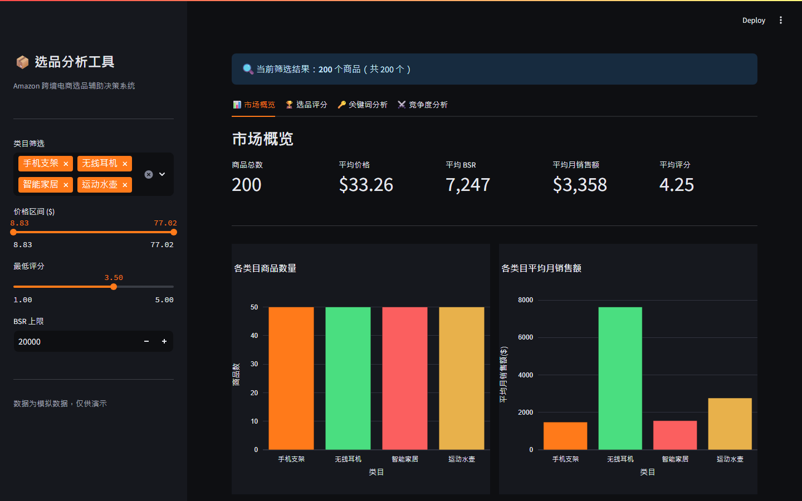
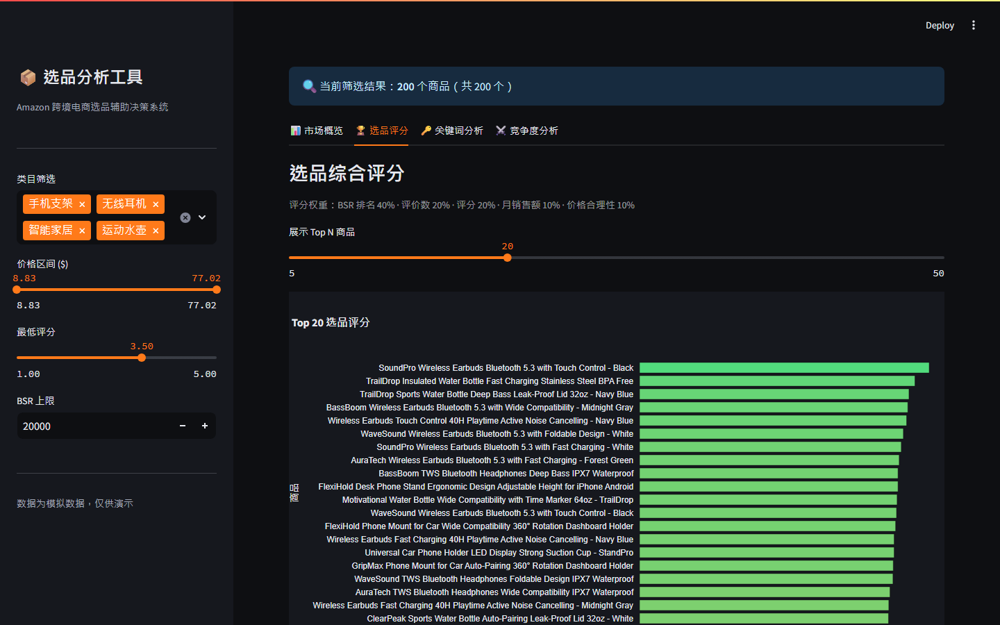
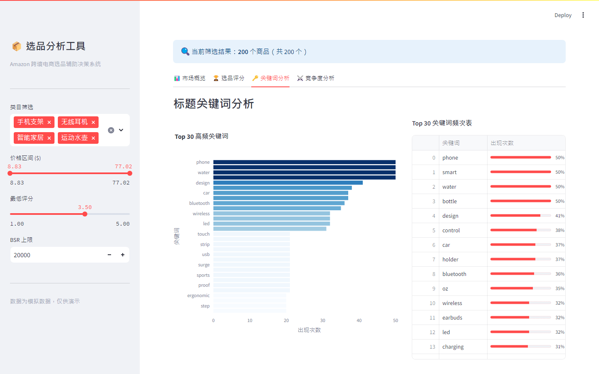
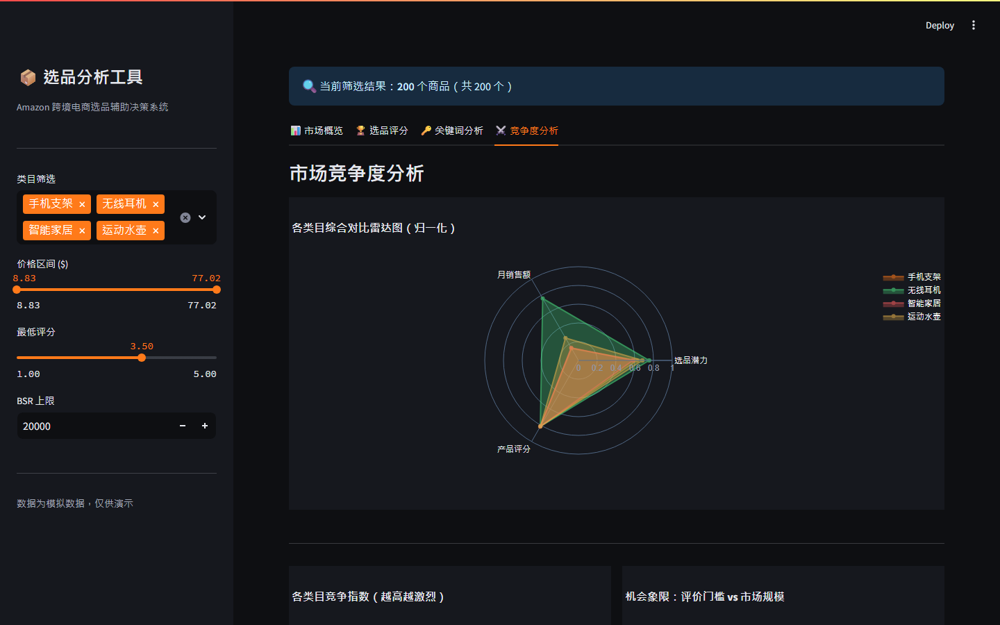

# Amazon 选品分析工具

> 基于 Python + pandas + Streamlit 构建的跨境电商选品辅助决策系统，通过 5 维加权评分模型与多维图表分析，将主观选品决策转化为可量化、可复现的数据驱动流程。



---

## 核心功能

| 标签页 | 功能说明 |
|--------|---------|
| 📊 市场概览 | 5 项 KPI 卡片（商品总数 / 平均价格 / 平均 BSR / 月销售额 / 平均评分）+ 类目商品数 / 月销售额柱状图 + 价格 / 评分分布直方图 |
| 🏆 选品评分 | Top N 横向条形图（RdYlGn 配色）+ 详情评分表（🟢🟡🔴 badge）+ BSR × 月销售额气泡散点图 |
| 🔑 关键词分析 | 标题词频统计 Top 30（去停用词）+ 条形图 + 各类目关键词对比（下拉切换） |
| ⚔️ 竞争度分析 | 竞争指数条形图 + 4 类目 × 3 维度雷达图 + 机会象限散点图（含"理想机会"标注区） |

**全局侧边栏筛选**（实时作用于所有 Tab）：类目多选 · 价格区间 slider · 最低评分（默认 3.5）· BSR 上限（默认 20000）

---

## 界面预览

| 选品评分（Top N 排名） | 关键词分析 |
|---------------------|-----------|
|  |  |

**竞争度分析**（含机会象限散点图）：



---

## 技术架构

```
product-research/
├── app.py               # Streamlit 主应用（~416 行）
│   ├── 侧边栏全局筛选
│   ├── Tab1：市场概览
│   ├── Tab2：选品评分
│   ├── Tab3：关键词分析
│   └── Tab4：竞争度分析
├── generate_data.py     # 模拟数据生成脚本
├── requirements.txt
└── data/
    └── amazon_products.csv   # 200 条模拟产品数据
```

**技术栈**

| 层级 | 技术 |
|------|------|
| 应用框架 | Python 3.11 · Streamlit ≥ 1.35 |
| 数据处理 | pandas ≥ 2.0 |
| 可视化 | Plotly ≥ 5.20（条形图 / 散点图 / 雷达图 / 漏斗图） |
| 数据来源 | 本地 CSV（200 条 mock 数据，无需网络） |
| 主题 | Night Freight 暗色配色（`.streamlit/config.toml` + Plotly `plotly_dark` 模板 · 货柜橙 #FF7A1A） |

---

## 评分模型

### 5 维加权公式

```
score = BSR分 × 0.40
      + 评价数分 × 0.20
      + 评分分  × 0.20
      + 月销售额分 × 0.10
      + 价格分   × 0.10
```

### 评价数分段函数（非线性）

```
< 50 条          线性增长 0→10（进入门槛低，机会好）
50 – 500 条      满分 10（最佳机会区间：有验证但竞争不过激）
500 – 2000 条    缓慢衰减（竞争加剧，进入成本提高）
> 2000 条        趋稳在 7 分（头部品牌区域）
```

### 其他维度计算

| 维度 | 计算方式 |
|------|---------|
| BSR 分 | `(1 - BSR / 20000) × 10`，线性归一化（BSR 越小分越高） |
| 评分分 | `(rating - 1) / 4 × 10`，线性映射 1–5 星 → 0–10 分 |
| 月销售额分 | `min(monthly_sales / 15000, 1) × 10`，上限 $15000 |
| 价格分 | $15–$50 满分；低于 $15 或高于 $50 线性衰减 |

### BSR → 月销售额推算公式

```
月销售额 ≈ base / BSR^0.55
```

`base` 值按类目不同（无线耳机 25000、手机支架 8000、智能家居 18000、运动水壶 12000），反映各类目销量基数差异。

---

## 竞争度分析方法

**竞争指数公式**：

```
竞争指数 = (平均评价数 / max评价数 × 50) + ((1 - 平均BSR / max BSR) × 50)
```

- 越高 → 该类目玩家实力越强，进入门槛越高
- **机会象限**（散点图 X 轴：竞争指数，Y 轴：月销售额）：
  - 左上：理想机会（低竞争 + 高销量）
  - 右上：高门槛高回报（需要较强实力）
  - 左下：冷门市场（容易进但规模小）
  - 右下：红海（高竞争低回报，建议回避）

---

## 数据说明

**来源**：完全本地 Mock，无需调用任何 API。

`generate_data.py` 生成 200 条记录：
- 类目：无线耳机 / 手机支架 / 智能家居 / 运动水壶（各 50 条）
- 字段：asin / title / brand / category / price / bsr / rating / reviews / monthly_sales / monthly_revenue / listed_date / score
- 价格范围：$12–$89（四类目各有不同均价）
- BSR 范围：200–19,800（含长尾品与热销品）

---

## 快速启动

```bash
# 安装依赖
pip install -r requirements.txt

# 生成模拟数据（首次运行，生成 data/amazon_products.csv）
python generate_data.py

# 启动应用
streamlit run app.py
# 访问 http://localhost:8501
```

> **注意**：必须先运行 `generate_data.py` 才能启动 app，否则应用因找不到 CSV 文件而报错中止。

---

## 🗺 后续规划

- [ ] 接入真实 Amazon SP-API 数据，替代 Mock CSV
- [ ] 新增利润率测算模块（价格 - FBA 费用 - 采购成本）
- [ ] 支持导出分析报告（PDF / Excel）
- [ ] 增加历史快照对比（追踪类目竞争度随时间变化）

---

## 简历描述

```
Amazon 选品分析工具 | Python + pandas + Streamlit + Plotly | 个人项目

• 设计 5 维加权评分模型（BSR 40% / 评价数分段 20% / 评分 20% 等），将选品判断量化为 0–100 分
• 实现 BSR → 月销售额估算公式（base / BSR^0.55），还原 Amazon 销量推算的运营方法论
• 构建竞争度分析模块，机会象限散点图直观识别「低竞争高销量」的蓝海品类
• 标题关键词词频分析（去停用词 + Counter Top30），辅助运营提炼竞品核心卖点
• 全局筛选联动 4 个 Tab，Streamlit 单文件架构实现零后端部署
```
