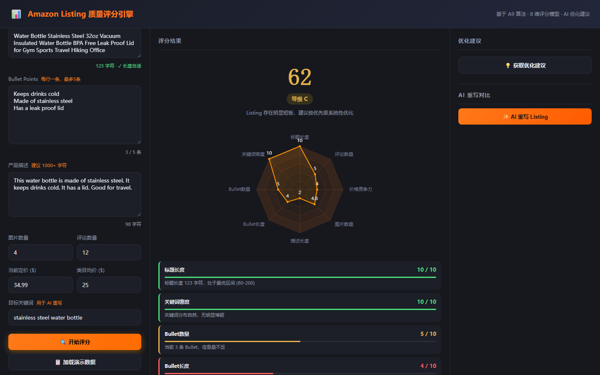
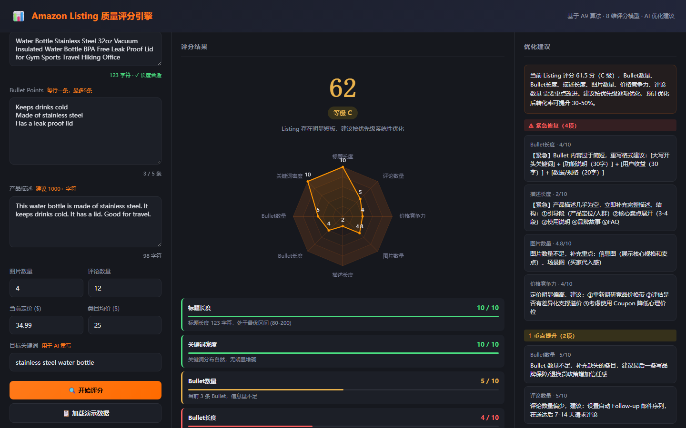
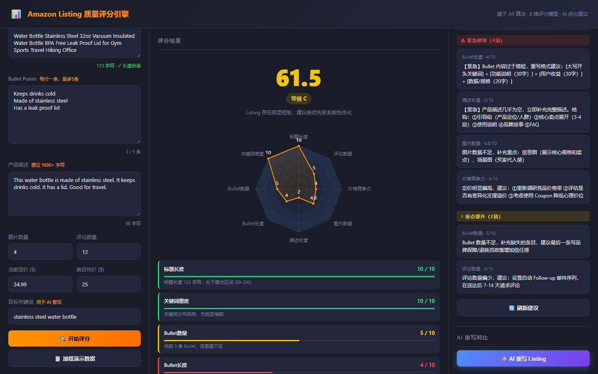

# 跨境电商学习与求职工作区

> 软件工程本科毕业，零基础转型跨境电商运营，目标岗位：**运营助理 / 数据运营助理 / 独立站运营**。  
> 目标平台：Amazon、Shopify。

---

## 项目展示

### 店铺数据看板（data-dashboard）

> Spring Boot 3 + Vue 3 + ECharts + MySQL | 还原 Amazon 运营日常数据监控场景

**总览页** — 核心指标卡片 + 销售趋势 + 广告 ACoS/ROAS


**广告 ACoS 趋势** — ACoS 趋势线含 35% 预警 markLine，visualMap 颜色分段（绿 / 橙 / 红）


**流量转化漏斗** — 页面浏览 → 访客会话 → 成功下单三层漏斗


**库存状态** — 断货红色行 / 预警橙色行 / 正常绿色标签


**功能亮点：**
- 整合销售、广告、流量、库存 4 大模块，聚合 12 项核心运营指标
- 广告表现模块追踪 ACoS（20%～38%）、CTR（1.5%～3.5%）等关键指标，含 35% 预警参考线
- 库存可销天数自动分级预警（橙色低库存 / 红色断货）
- 支持 7 / 30 / 90 天 / 全部时间维度切换
- EasyExcel 双 Sheet 报表一键导出（销售数据 + 广告数据）
- 覆盖 180 天模拟数据，含情人节、618 等大促节点

---

### 选品分析工具（product-research）

> Python + pandas + Streamlit + Plotly | 数据驱动的 Amazon 选品决策系统

**市场概览** — 类目筛选、价格区间、BSR 范围多维过滤，实时更新图表


**选品评分** — BSR/评价数/评分/月销售额/价格五维加权评分，Top N 动态排行


**关键词分析** — 标题高频词词频柱状图 + ProgressColumn 频次表


**竞争度分析** — 各类目综合雷达图 + 机会象限（低竞争 vs 高销量）


**功能亮点：**
- 数据集覆盖 200 个产品、4 大类目（无线耳机 / 手机支架 / 智能家居 / 运动水壶）
- 5 维加权评分：BSR（40%）、评价数分段函数（20%）、产品评分（20%）、月销售额（10%）、价格合理性（10%）
- 竞争度分析与机会象限散点图，识别「低竞争 + 高销量」蓝海品类
- 4 个功能标签页、8 种 Plotly 交互图表；侧边栏多维筛选联动全部 Tab

---

### 竞品监控系统（competitor-monitor）

> Spring Boot 3 + MyBatis-Plus + Vue 3 + ECharts + MySQL | 自动化竞品预警

**监控看板** — 4 个核心指标卡 + 最新预警列表，一屏掌握所有异动


**商品列表** — 分页展示 50+ 监控 ASIN，支持品牌 / 标题 / ASIN 实时搜索


**价格 & BSR 走势** — 双折线图，支持 7 / 30 / 90 天切换


**预警配置** — 全局阈值 + ASIN 级独立配置（ASIN 级优先），预警记录按已读 / 未读筛选


**功能亮点：**
- 覆盖 50 个 ASIN、5 大品类，90 天历史时序数据约 13,500 条
- 支持价格下跌 / 上涨 / BSR 改善 / BSR 下滑 4 种预警类型
- 两级预警配置：ASIN 级独立阈值优先，无配置时回退全局默认值
- 7 / 30 / 90 天价格与 BSR 走势折线图，markPoint 标注最高 / 最低点

---

### Amazon Listing 优化引擎（listing-optimizer）

> Python Flask + Vue 3 + ECharts | Listing 质量评分 + AI 改写建议

**评分结果** — 8 维 Dark 主题雷达图 + 各维度进度条得分卡



**优化建议** — 规则引擎按优先级输出⚠紧急修复 / ↑重点提升 / ✓速效优化三级建议



**AI 重写对比** — 标题 / Bullet / 描述分 Tab 展示重写结果，无 API Key 时 Mock 模式完整演示



**功能亮点：**
- 8 维加权评分模型（标题长度、关键词密度、Bullet 数量/长度、描述完整度、图片数量、价格竞争力、评论数），输出 0～100 分及 A/B/C/D 四级评级
- 规则引擎按得分自动分三级优先级返回中文优化建议
- 集成 OpenAI GPT-4o 进行英文 Listing 重写；无 API Key 时自动回退 Mock 模式，面试演示效果一致
- 「加载演示数据」一键填充低分 Listing，30 秒内完成完整演示流程

---

## 目录结构

```
cross-border-ecom/
├── 00-knowledge/                   # 行业知识专题笔记
│   ├── platforms/
│   │   ├── amazon-basics.md        # Amazon 平台基础入门
│   │   ├── amazon-ads.md           # 广告系统详解（SP/SB/SD/投放节奏）
│   │   ├── keyword-research.md     # 关键词研究方法论
│   │   └── product-selection.md    # 选品标准化五步法
│   └── glossary.md                 # 通用术语表（50+ 词条）
├── 01-projects/                    # 实战项目
│   ├── competitor-monitor/         # 竞品监控系统（Spring Boot + Vue 3）
│   ├── data-dashboard/             # 店铺数据看板（Spring Boot + Vue 3）
│   ├── listing-optimizer/          # Listing 优化引擎（Flask + Vue 3）
│   └── product-research/           # 选品分析工具（Streamlit）
├── 03-resources/                   # 参考资料
└── docs/screenshots/               # 项目界面截图
```

---

## 本地运行

### 选品分析工具（product-research）

```bash
cd 01-projects/product-research
pip install -r requirements.txt
python generate_data.py   # 首次运行，生成 CSV
streamlit run app.py
# 访问 http://localhost:8501
```

### 店铺数据看板（data-dashboard）

```bash
# 1. 初始化数据库
mysql -u root -p < 01-projects/data-dashboard/sql/init.sql

# 2. 生成 180 天模拟数据
cd 01-projects/data-dashboard/data-scripts
pip install mysql-connector-python
python generate_store_data.py

# 3. 启动后端（端口 8081）
cd 01-projects/data-dashboard/backend
DB_PASSWORD=你的数据库密码 mvn spring-boot:run

# 4. 启动前端
cd 01-projects/data-dashboard/frontend
npm install && npm run dev
# 访问 http://localhost:5173
```

### 竞品监控系统（competitor-monitor）

```bash
# 1. 初始化数据库 & 生成模拟数据
mysql -u root -p < 01-projects/competitor-monitor/sql/init.sql
cd 01-projects/competitor-monitor/data-scripts
python mock_data_generator.py

# 2. 后端（端口 8080）
cd 01-projects/competitor-monitor/backend
DB_PASSWORD=你的数据库密码 mvn spring-boot:run

# 3. 前端
cd 01-projects/competitor-monitor/frontend
npm install && npm run dev
# 访问 http://localhost:5173
```

### Listing 优化引擎（listing-optimizer）

```bash
cd 01-projects/listing-optimizer/backend
pip install -r requirements.txt
python app.py   # 后端端口 5000

cd 01-projects/listing-optimizer/frontend
npm install && npm run dev
# 访问 http://localhost:3000
```

---

## 学习进度

### 平台知识

- [x] Amazon 平台基础（FBA/FBM/BSR/ACOS）
- [x] Amazon 广告系统（SP / SB / SD 广告投放节奏）
- [x] Amazon SEO 与关键词研究方法论
- [x] 选品标准化流程（五步法 + 快速筛选清单）
- [ ] Shopify 独立站基础搭建
- [ ] Shopify + Facebook Ads 投放逻辑

### 实战项目

- [x] 选品数据分析工具（Python + Streamlit）
- [x] Listing 质量评分工具（Flask + Vue 3 + AI 优化）
- [x] 店铺销售数据看板（Spring Boot + Vue 3 + ECharts）
- [x] 竞品价格/BSR 监控预警系统（Spring Boot + Vue 3）

---

## 知识笔记

| 文件 | 内容 |
|------|------|
| [Amazon 基础入门](00-knowledge/platforms/amazon-basics.md) | FBA/FBM 对比、BSR 原理、开店流程、运营助理日常 |
| [广告系统详解](00-knowledge/platforms/amazon-ads.md) | SP/SB/SD 广告类型、新品投放四阶段、报告分析、常见误区 |
| [关键词研究方法](00-knowledge/platforms/keyword-research.md) | 关键词分类、五步免费挖词、Listing 布局规范 |
| [选品标准化流程](00-knowledge/platforms/product-selection.md) | 选品五步法、竞争度量化标准、利润核算、10 分钟筛选清单 |
| [通用术语表](00-knowledge/glossary.md) | 50+ 词条，含平台 / 广告 / 物流 / 财务四类 |

---

*最后更新：2026-06-16*
